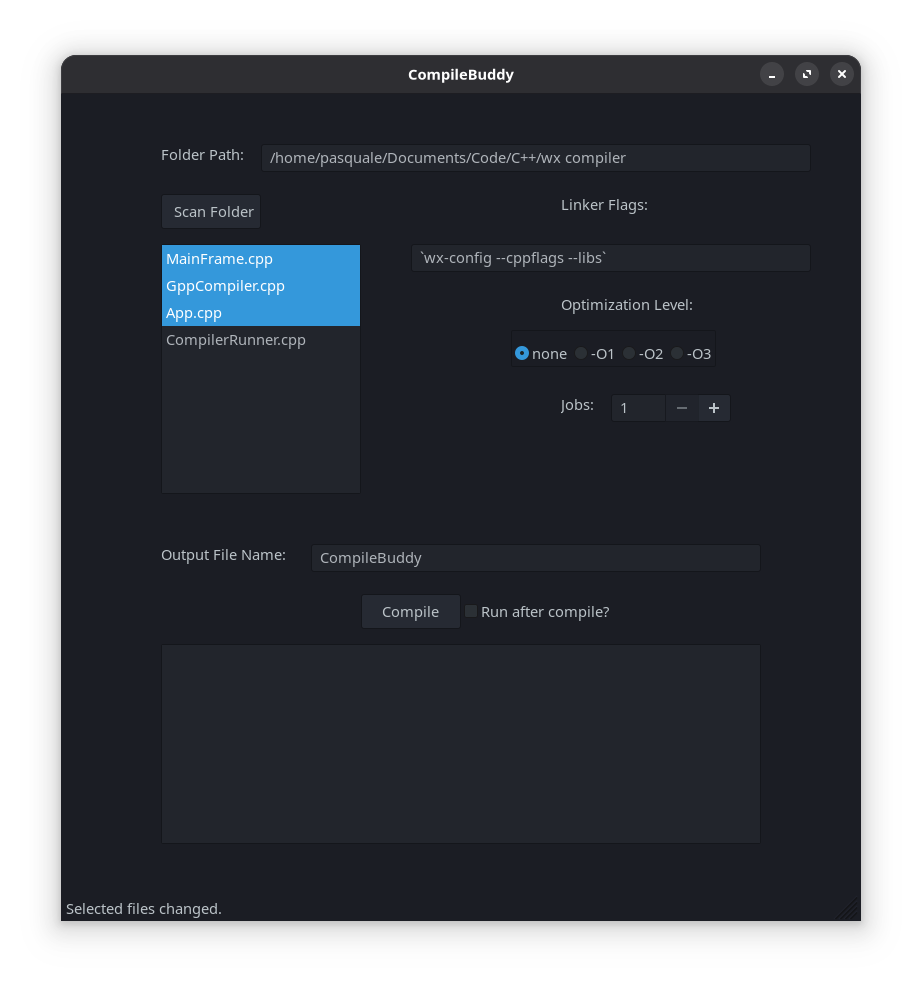

# Simple_Compiler_GUI

## Dependencies
-Requires that [wxWidgets be installed on your system](https://docs.wxwidgets.org/3.2/overview_install.html).  
-Also requires [G++](https://gcc.gnu.org/install/)

## Compilation
Compile the project with:
``g++ App.cpp MainFrame.cpp `wx-config --cppflags --libs` ``

`` `wx-config --cppflags --libs` `` runs this command separately to get the linker flag locations for your specific system, and then returns the string to be used with g++.

## Usage

- Enter in your full **Folder Path** first.
- **Scan** the folder.
- **Select** one file, or multiple files by clicking and holding shift/ctrl.
- Set your **Linker Flags**.
- **Optmization Level** can be set.  This is optional.
- Click **Compile**.

## Features that currently do not work
- **Run after compile?**
- **Jobs**

